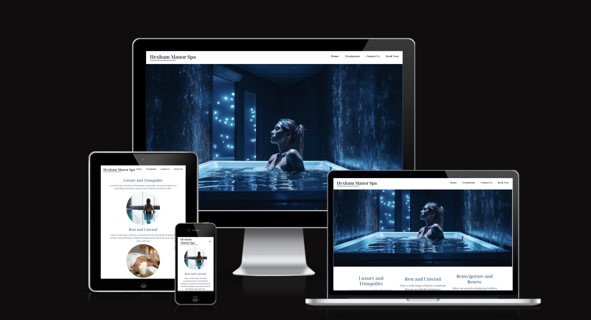

<h1 align="center">Hexham Manor Spa</h1>

- - - 

# Hexham Manor Spa

Hexham Manor Spa is a fictional luxury spa located in Northumberland. They are looking to improve their online presence and are beginning by updating their website. They have requested a striking and modern style for their new website. 

The website created for them is a four-page website that aims to showcase the spa as a peaceful haven of sumptuous escapism from the fast-paced reality of todays culture. The site describes the treatments and facilities available at the spa their benefits to the users' health. The site will be targeted towards adults who are looking to relax ad unwind. The target audience will use the site to see the Spa ethos, imagery and text description of the treatments and facilities available, as well as pricing and the ability to make a booking enquiry.

[View the live project here.](https://chloel-e.github.io/msp1/)

## Contents
* [Languages Used](#languages-used)
* [User Experience](#user-stories)
* [Design]  
  * [Color Scheme](#color-scheme)
  * [Typography](#typography)
  * [Imagery](#icons)
  * [Wireframes] (#wireframes)
* [Structure](#design)
  * [Features](#features)
  * [Features For The Future](#features-for-the-future)
* [Technologies Used](#technologies-used)
  * [ Frameworks, Libraries & Programs Used](#frameworks-libraries--programs-used)
* [Testing](#testing)
  * [User Experience](#user-experience-ux)
  * [Accessibility](#accessibility)
  * [Deployment](#deployment)
  * [Run locally](#run-locally)
* [Credits](#credits)

- - - 

## Languages Used
*  [HTML5](https://en.wikipedia.org/wiki/HTML5)
*  [CSS3](https://en.wikipedia.org/wiki/Cascading_Style_Sheets)
*  [JS](https://en.wikipedia.org/wiki/JavaScript)

 

- - - 

## User Experience (UX)

-   ### User stories

    -   #### First Time Visitor Goals

        1. As a first time visitor, I want to be able to easily navigate throughout the site to find content.
        2. As a first time visitor, I want to easily understand the main purpose of the site and learn more about the spa.
        3. As a first time visitor, I want to understand what treatments and facilities are offered by the spa and find out the purpose, duration  and cost of each of treatment available. 
        4. As a first time visitor, I want the website to be visually appealing and give me some insight about the style and aesthetic of the spa.
        5. As a first time user I also want to locate the spas' social media links to see their followings on social media, to determine how trusted and known they are and to see up to date posts of current events and new treatments available at the Spa.
        6. As a first time customer,  I want to be able to easily make a booking enquiry and know that it has been sent.
        7. As a first time customer, I want to be able to find out the location of the spa and how to contact the spa if required.

    -   #### Returning Visitor Goals

        1. As a returning visitor, I want to find information about different treatments, duration and pricing.
        2. As a returning visitor, I want to find the best way to get in contact with the organisation with any questions I may have.
        3. As a returning visitor, I want to be able to make a booking enquiry.
        4. As a returning visitor, I want to find social links.

    -   #### Frequent User Goals
        1. As a frequent visitor, I want to check to see if there are any new treatments.

- - - 

## Design

-   ### Colour Scheme
    * The colour palette used for Hexham Manor Spa's website was created using [coolors](https://coolors.co/) 
    * This colour palette was created using natural, calm, cool colours that compliment the spa's elegant aesthetic, encapsulating peace and traquility. 
    * There is a range in the colours within the palette so that a good contrast is achieved at all times between text and background-colors.

-   ### Typography
    * The Noto Serif Sans font is the main font used throughout the whole website with Sans Serif as the backup font in case for any reason the font isn't being imported into the site correctly. Noto Serif Sans is a high-quality font developed specifically for easy online consumption. It is a user-friendly, beautiful clean and crisp typeface that compliments the design.

-   ### Imagery
    * Imagery has an important role in the website. The large, hero image on each page is designed to be striking and catch the user's attention. Each image was chosen for its natural, relaxing feel and deep colours. The images aim to add a cosy, luxurious atmosphere in-keeping with the spa's aesthetic. They also give the user a good insight into the physical look of the spa.

-   ### Wireframes

    * Our Story Home Page Wireframe - [Balsamiq home page wireframe](documentation/our_story_wireframe.jpeg)
    * Treaments Page Wireframe - [Balsamiq treatments page wireframe](documentation/treatments_wireframe.jpeg)
    * Contact Us Page Wireframe - [Balsamiq Contact Us page wireframe](documentation/contact_wireframe.jpeg)
    * Booking Page Wireframe - [Balsamiq Booking page wireframe](documentation/booking_wireframe.jpeg)

- - - 

## Structure

-   ### Features
    * Responsive on all device sizes from 260px

    -   #### Navigation Bar
        * The responsive navigation bar has been applied to all four pages so that the pages are uniform, which is more visually appealing and improves user experience. It is also 'sticky' so that it is visible at all times no matter where the user is on the webpage. The navigation bar includes clear links to the Home, Treatments, Contact Us and Book Now pages.
        * The navigation section promotes ease of use for the user, allowing the user to move easily between sections and pages.

       

       * On a mobile device the navigation bar utilises a hamburger menu to improve appearance and user experience.

       

       * The Hamburger menu uses Javascript to open and close the hamburger menu when it is 'clicked' and when 'open', the navbar links slide across the page and become visible to the user.

       

    -   #### Hero Images
        * There is a striking hero image on each webpage to attract the attention of the user. 
        * Each hero image, apart from the hero image on the Booking Page, have a hero zoom animation applied. The zoom animation was removed from the Booking Page as it detracted from the booking enquiry form.

        

    -   #### Home page

        * The Our Story section that is found on the Home page will allow the user to see the Spas' ethos and important information, with the aim to show the benefits to the resotative treatments and some self-indulgence. There are 3 images to add visual appeal and interest to the page, whilst also showcasing the Spa.
        * The user will see the value of a luxury Spa experience and will consider making a booking enquiry via the site. 

        

    -   #### Treatments page
        * This page will allow the user to see exactly what treatments are available to book. Images are paired with the treatment information to show the user what the treatment may look like. When the user hovers over an image, an overlay appears to show the duration and cost of the treatment they are viewing.
        * This page will be updated with any new treatments available or seasonal offers.

        

    -    #### Contact Us Page
         * The map will provide the user with a visual aid to see the location of the spa.
         * This section is valuable to the user as they will be able to easily identify the the location of the spa and how to contact the spa if they require.

         

    -    #### Booking Page
         * This page will allow the user to send a booking enquiry. 
         * The user will be asked to submit their full name, email address and telephone number. The user will have the option to give some further information with the booking enquiry. 
         * The user will recieive feedback once they press the submit button to inform them that they will be contacted soon regarding their booking enquiry.

         

    -    #### Footer
         * The footer section includes links to the social media sites for Hexham Manor Spa. The links will open to a new tab to allow easy navigation for the user.
         * The footer is valuable to the user as it encourages them to keep connected via social media and gives easy access to interesting information about what is happening at the Spa.

         

    -    #### 404 Error Page
          * A 404 error page was created to ensure that if, for any reason, the webpage is unavailable, the user is taken to a message page which helps to redirect them back to the website.

         

    -    #### Thank You Page
          * The user is taken to a Thank you page after submission of the booking enquiry form on the Booking page. This opens in a new browser tab. This improves user experience as they recieve feedback that their enquiry form was sent successfully. The new tab in the browser means the user can easily move back to the website.

         

-   ### Features For The Future
    * In the future a 'Book Online' feature will be implemented that will allow the user to directly book their treatments online rather than sending a booking enquiry or needing to speak to a member of the spa team. This should improve user experience as they can more efficiently book our services. 
    * FAQ page- this would be beneficial to the customer to view answers to commonly asked questions for more insight into the spa.
    * Button taking the user back to the top of the page for easy access back to the top of the page.

- - - 

## Technologies Used

-   ### Frameworks, Libraries & Programs Used

    * Google fonts were used to import the 'Noto Sans Serif' font into the style.css file which is used on all pages throughout the project. [Google Fonts:](https://fonts.google.com/)
    * Font Awesome was used on all pages throughout the website to add icons for aesthetic and UX purposes[Font Awesome:]( https://cdnjs.cloudflare.com/ajax/libs/font-awesome/6.4.2/css/all.min.css)
    * Visual Studio code was the IDE used and within this Git was used for version control by utilizing the terminal to commit changes and Push to GitHub. [VScode:](documentation/gitdemo.jpeg)
    * GitHub is used to store the projects code after being pushed from Git.[GitHub:](https://github.com/)
    * Balsamiq was used to create the wireframes to support in the design process.[Balsamiq:](https://balsamiq.com/)

- - - 

# Testing

-   ### Testing User Stories from User Experience (UX) Section

    -    #### First Time Visitor Goals

    * As a First Time Visitor, I want to be able to easily navigate throughout the site to find content.

      1. Upon arrival to webpage, the user is greeted with a clean, clear navigation bar with easily identifiable links to each page. 
      2. The navigation bar is designed so that it is always visible at the top of the page so that the user can easily navigate to another part of the site.
      3. A 404 error page has been created if, for any reason, a page is not able to load. From this, the user will be able to quickly navigate back to the webpage to continue their enjoyment of the website.

    * As a First Time Visitor, I want to easily understand the main purpose of the site and learn more about the spa.

      1. The spas' name stands alone to the left of the navigation bar, making it clear and stand out. The hero image provides a visual, to let the use understand that it is immediately clear that they are visiting a spa website.

    * As a First Time Visitor, I want to understand what treatments and facilities are offered by the spa and find out the purpose, duration of treamtment and cost of each. 

      1. The navigation bar has a clean and clear link to the Treatments page.
      2. The user can also access the Treatments page by following the link within the 'Quick Links' section of the Footer
      3. Once the user has clicked a Treatments link, they are taken to the Treatments page, which has image and text information to inform the user about all of the treatments available at the spa. 
      4. When the user hovers over a Treatment image, information about the duration and cost of the treatment is shown.

    * As a first time visitor, I want the website to be visually appealing and give me some insight about the style and aesthetic of the spa

      1. When the user navigates around the site they will find a hero image on each page which showcases the spa aesthetic and some of the facilities available a the spa.
      2. The user will find further images on both the Home page and the Treatments page. These images are designed to be circular to soften the look of the webpage.
      3. The colour palette was chosen to feel natural, cool and calming, and the images chosen to compliment these natural tones.

    * As a first time user I want to locate the Spas' social media links to see their followings on social media to determine how trusted and known they are and to see up to date posts of current events and new treatments available at the Spa.

      1. The Footer is located at the bottom of each webpage and is access by scrolling down. 
      2. Once the user has arrived at the Footer they will be able to clearly see the social media links to the spa under the 'Follow Us' heading.
      3. Each social link opens as a new tab so that the user can easily come back to the website.

    * As a first time customer,  I want to be able to make a booking enquiry.
      
      1. The user will be able to clearly navigate to the Booking page using either the 'Book Now' link in the navigation bar or the call-to-action button in the Footer.
      2. Either link will take the user to the Book Now page where a form is clearly visible within the pages hero image.
      3. The user is directed to complete the booking enquiry form by the call to action 'Lets Make A Date!'.
      4. The form is clearly labelled so that the user will easily understand what information is required from them. A placeholder in the textarea also indicates the information to input in this area.
      5. Once the user has submitted the form using the Submit button, they are taken to a 'Thank you' page so that they know their enquiry has been successful. The message on this page informs them that they will be contacted shortly.

    * As a first time customer, I want to be able to find out the location of the spa and how to contact the spa if required.

      1. The user can easily navigate to the Contact page by the navigation bar or using the 'Quick Links' link in the Footer. 
      2. Once the user has clicked on the Contact Us link, the user will be taken to the Contact page. They will be able to scroll down the page to see links to the spas' email and telphone number, along with the spa address and a google map of the location.
      3. A 'Get in Touch' section within the Footer also shows the user the email and telephone number. 

    * As a Returning Visitor, I want to find the Facebook Group link so that I can join and interact with others in the community.
        
      1. The Facebook Page can be found at the footer of every page and will open a new tab for the user and more information can be found on the Facebook page.
      2. Alternatively, the user can scroll to the bottom of the Home page to find the Facebook Group redirect card and can easily join by clicking the "Join Now!" button which like any external link, will open in a new tab to ensure they can get back to the website easily.
      3. If the user is on the "Our Favourites" page they will also be greeted with a call to action button to invite the user to the Facebook group. The user is incentivized as they are told there is a weekly favourite product posted in the group.-->

- - - 

-   ### Accessibility

    -    #### Validators

         * W3C Markup Validator, W3C CSS Validator Services were used to validate this project to ensure that there were no syntax errors in the project.
         * Markup Validator 
          - Home Page W3C HTML Validation - Pass
          - Treatments Page W3C HTML Validation - Pass
          - Contact Page W3C HTML Validation - Pass
          - Booking Page W3C HTML Validation - Pass
          - Thank You Page W3C HTML Validation - Pass
          - 404 Page W3C HTML Validation - Pass
         * CSS Validator 
          - style.css CSS Validation - Pass
         * Jshint was used to validate the Javascript
          - main.js Jshint - Pass

    -    #### WAVE accessibility tool

    * The website was developed to be as inclusive as possible. The use of semantic HTML, aria-labelling, alt attributes to images and good colour contrast.
    * The WAVE Web Accessibility Evaluation Tool was used to assess each webpage [wave](https://wave.webaim.org/)
    * The Home page showed no errors or contrast errors but identified two alerts. An alt attribute to identify the 'Book Now' button. An alt tag was added which fixed the alert. An alert identified with the Hamburger toggle. The function requires a click which would not be accessible to keyboard users. 
    * The Treatments page identified no errors or contrast errors.
    * The Contact Us page identified no errors or contrast errors. One alert was identified which showed a redundant link. Adjacent links go to the same URL (logo and home), therefore the logo link was removed to improve efficiency of movement through the webpage for screenreaders. 
    * The Booking page showed two errors. For a missing form label and for an empty button. These errors were corrected.

    -    #### Lighthouse 
  Lighthouse within the Chrome Developer Tools are used to test performance, accessibility, best practices and SEO of the spa Website.
    - Performance was the only issue and the majority of this is due to the images slowing the load time therfore the images used within the content on Home and Treaments page were converted from jpeg to png files. This improved the performance. The hero images to each page were not converted as it did not improve the performance rating but the image quality reduced.
  
  * [See Lighthouse report for Home page](documentation/lighthouse-home.png)
  * [See Lighthouse report for Treatments page](documentation/lighthouse-treat.jpeg)
  * [See Lighthouse report for Contact Us page](documentation/lighthouse-contact.png)
  * [See Lighthouse report for Booking Enquiry page](documentation/lighthouse-book.png)

- - - 

-   ### Deployment

Github was used as version control. Visual studio code was the IDE used to build the website, code was added and commited in the terminal and then pushed to Github.
This site is hosted using GitHub pages, deployed directly from the master branch. The deployed site will update automatically upon new commits to the master branch. In order for the site to deploy correctly on GitHub pages, the landing page must be named index.html.

To deploy this page to GitHub Pages from its [GitHub repository:](https://github.com/ChloeL-E/msp1), the following steps were taken: 
1. Login or Sign Up to GitHub.
2. Open the project repository.
3. From the menu items near the top of the page, select **Settings**.

4. Click on "Pages" in the left hand navigation panel.
5. Under "Source", choose which branch to deploy. This should be Main for newer repositories (older repositories may still use Master).
6. Choose which folder to deploy from, usually "/root".
7. Click "Save", then wait for it to be deployed. 
It can take some time for the page to be fully deployed.
8. Your URL will be displayed above "Source"

-   ### Run locally

**Fork**
1. Login or Sign Up to GitHub.
2. Open the project [repository](https://github.com/ChloeL-E/msp1).
3. Click the Fork button in the top right corner.

**Clone**
1. Login or Sign Up to GitHub.
2. Open the project [repository](https://github.com/ChloeL-E/msp1).
3. Click on the code button, select whether you would like to clone with HTTPS, SSH or GitHub CLI and copy the link shown.
4. Open the terminal in the code editor of your choice and change the current working directory to the location you want to use for the cloned directory.
5. Type 'git clone' into the terminal and then paste the link you copied in step 3. Press enter.

- - - 

-   ### Testing site functionality

| **Purpose**                                                                | **Action**                                                                | **Expected**                                                                                                     | **Result** |
| -------------------------------------------------------------------------- | ------------------------------------------------------------------------- | ---------------------------------------------------------------------------------------------------------------- | ---------- |
| Ensure website is responsive                                               | Using developer tools and different device sizes, shrink website to 260px | Site is responsive on all devices                                                                                | PASS       |
| Take to Home page link                                                     | From navigation bar, click Home link                                      | Taken to Home page                                                                                               | PASS       |
| Take to Treatments page link                                               | From navigation bar, click Treatments                                     | Taken to Treatments page                                                                                         | PASS       |
| Take to Contact Us page link                                               | From navigation bar, click Contact Us                                     | Taken to Contact Us page                                                                                         | PASS       |
| Take to Booking page                                                       | From navigation bar, click Book Now                                       | Taken to Booking page                                                                                            | PASS       |
| Take to Facebook page in new browser tab                                   | From Social links in Footer, click Facebook icon                          | New tab opens in browser with the Facebook website                                                               | PASS       |
| Take to Instagram page in new browser tab                                  | From Social links in Footer, click Instagram icon                         | New tab opens in browser with the Instagram website                                                              | PASS       |
| Take to YouTube page in new browser tab                                    | From Social links in Footer, click YouTube icon                           | New tab opens in browser with the YouTube website                                                                | PASS       |
| Take to Twitter page in new browser tab                                    | From Social links in Footer, click Twitter icon                           | New tab opens in browser with the Twitter website                                                                | PASS       |
| Take to Booking page                                                       | Click Book Now in Footer                                                  | Taken to Booking page                                                                                            | PASS       |
| Form Input fields set to 'required'                                        | Click Submit button without correctly completing each of the valid inputs | Form does not send and message asks 'Please fill in this field'                                                  | PASS       |
| Form Email input is 'required' and must be valid                           | Click Submit button without inserting a correctly formatted email address | Form does not send and message asks 'Please include an '@' in the email address'                                 | PASS       |
| Booking form calendar input is a 'required field                           | Click Submit button without inserting a valid date                        | Form does not send and message asks 'Please enter a valid value. The field is incomplete or has an invalid date' | PASS       |
| Booking form calendar input shows calendar/time when field is clicked      | Click calendar input field                                                | Calendar appears and a valid date/time can be picked.                                                            | PASS       |
| Submit booking enquiry form                                                | Complete the form on the Booking page and click Submit                    | Taken to Thank You page                                                                                          | PASS       |
| Navigation links change text and background-colour when mouse hovers over  | Hover mouse over Home, Treatment, Contact Us, then Book Now               | Each link independently changes colour when hovering over with mouse                                             | PASS       |
| Footer links change text and background-colour when mouse hovers over      | Hover mouse over Facebook, Instagram, YouTube, Twitter and Book Now       | Each link independently changes colour when hovered over with mouse                                              | PASS       |
| Treatment page image overlays show text information when mouse hovers over | Hover mouse over each Treatment page image                                | Each image overlay smoothly transitions with good contrast between text and background-colour                    | PASS       |

Each action was tested and found to work as expected. 
Chrome developer tools were used to identify and resolve any issues or bugs throughout the development process. 

- - - 

-   ###  Further Testing

    * The Website was tested on Google Chrome, Microsoft Edge, Internet Explorer and Safari browsers.
    * The website was viewed on a variety of devices such as Desktop, Laptop, Tablets and Phones using dev tools and real devices.
    * The website was sent to friends and family members to review the site and test it from a user perspective.

- - - 

-   ### Fixed Bugs
    * The header would not align correctly using bootstrap but the footer did, using flexbox. The header was rewritten to use flexbox and the issue was resolved.
    * The hamburger click functon would not work. On media screens with max-width 600px, the "click" function causes the nav menu to slide out from left to right below the header. Utilising dev tools and console.log to log each click it was clear that the javascript was working but it was the css that was not working as expected. A background-color of red was added to the nav-menu and it was made clear that it needed .nav-menu.active set with left:0. This fixed the problem.
    * The contact-address and contact-detils were misaligned on smaller screen sizes. This was fixed by giving both classes a width and altering the padding on the media queries.
    *  A dark line showed on media screen size max-width 600px when using Chrome dev tools. This was fixed by removing the scroll property.
    * The images had a slow load time, which was highlighted using Lighthouse. This was improved by dowloading the smallest image size, running the images through cloud convert and then using tiny.png to compress it. This improved load times substantially.

- - - 

## Credits

-   ### Content

- Instruction on creating a responsive navigation bar and a google map in a webpage provided by Dani Krossing [YouTube](https://www.youtube.com/watch?v=HkNNyDtm7mg)

- Instruction on creating a responsive footer were taken from TheWebShala [Youtube](https://www.youtube.com/watch?v=YOb67OKw62s&t=333s)

- Information about building responsive content with images and text was provided by Learn Web [Youtube]{https://www.youtube.com/watch?v=Rqo_1TV7wQs}

- Instruction on creating a responsive hamburger menu was taken from Web Dev Tutorials [Youtube](https://www.youtube.com/watch?v=flItyHiDm7E&t=361s) 

- [cloudconvert] {https://cloudconvert.com/} was used to convert images to webp format.

- [tiny.png]{https://tinypng.com/} was used to compress images.

- [w3schools] was utilised for supporting information throughout the project, in particular for the header, footer, images and form.

- [MDNwebdocs] was utilised for supporting information throughout the project, in particular for the header, footer, images and form.

- The icons in the footer were taken from [Font Awesome](https://fontawesome.com/)

- The map on the Contact Us page used [Google Maps Api](https://developers.google.com/maps/documentation/javascript/get-api-key ) and the latitude and longtitude were found using [LatLong.net](https://www.latlong.net/)

-  [CodeInstitute] For their content and guidance through the whole process.

- Content was written by Chloe Livingstone-Evans.

- - - 

-   ### Media Images

- All images are taken from [Freepik] and are further attributed as follows: 

- The Home hero image is by [Vecstock](https://www.freepik.com/free-ai-image/wet-young-woman-enjoying-luxury-spa-treatment-generated-by-ai_41571817.htm#page=3&query=spa&position=7&from_view=search&track=sph)

- The image for Luxury and Tranquility is by [Freepik](https://www.freepik.com/free-photo/woman-relaxing-spa_3508172.htm#query=woman%20relaxing%20spa%20water&position=41&from_view=search&track=ais&uuid=0dc33f71-a56e-414e-bf83-cd18809fb439)

- The image for Rest and Unwind is by [cookie_studio](https://www.freepik.com/free-photo/young-woman-having-face-massage-relaxing-spa-salon_8224621.htm#query=spa&position=0&from_view=search&track=sph)

- The image for Reinvigorate and Renew is from [Freepik](https://www.freepik.com/free-photo/spa-concept-with-woman-relaxing-water_3505120.htm#query=spa-concept-with-woman-relaxing-water&position=1&from_view=search&track=sph&uuid=e5cbf2e2-6fbd-40f2-be89-c617498c5485)

- The hero image for the Treatments page is by[vecstock](https://www.freepik.com/free-ai-image/scented-candle-burning-bowl-creating-tranquil-scene-generated-by-ai_52297585.htm)

- The image for Work It out is by [gpointstudio](https://www.freepik.com/free-photo/woman-relaxing-spa_12930395.htm#query=spa&position=31&from_view=search&track=sph). 

- The image for Drift Away is by [valuavitaly](https://www.freepik.com/free-photo/handsome-man-having-stone-massage-spa-salon-healthy-lifestyle_11178510.htm#query=hot%20stone%20massage&position=48&from_view=search&track=ais)

- The image for New Beginnings is by [cookie_studio](https://www.freepik.com/free-photo/attractive-african-woman-enjoying-face-massage-spa-salon_9028017.htm#query=spa&position=4&from_view=keyword&track=sph%22%3EImage%20by%20cookie_studio")

- The image for The Ultimate Unwind is by [javi_indy](https://www.freepik.com/free-photo/young-woman-receiving-back-massage-spa-center_1319025.htm#query=swedish%20massage&position=19&from_view=search&track=ais)

- The image for Face Spa is by [FreePik](https://www.freepik.com/free-photo/spa-concept-with-woman-with-creme-face_2279922.htm#query=spa-concept-with-woman-with-creme-face&position=1&from_view=search&track=sph&uuid=ab0ea5ba-b81e-4fb6-88a5-8e3f3a736f42)

- The image for Reflexology and Foot Massage is by [chevanon](https://www.freepik.com/free-photo/woman-getting-foot-massage_999590.htm#query=foot%20spa&position=39&from_view=search&track=ais)

- The hero image on the Contact Us page is by [wirestock](https://www.freepik.com/free-photo/reflection-castle-pond-autumn_16369074.htm#query=manor%20house&position=22&from_view=search&track=ais&uuid=a0a3fa9b-d49f-4472-b027-eae8f4c15daf)

- The hero image on the Book Now page is by [pvproductions] (https://www.freepik.com/free-photo/attractive-young-woman-is-relaxing-spa-complex-with-sauna_30906865.htm#page=4&query=spa&position=0&from_view=search&track=sph)

- The favicon in the browser tab was created using[Favicon](https://favicon.io/logo-generator/) and instruction on implementation from [W3schools](https://www.w3schools.com/html/html_favicon.asp)

- - - 

## Acknowledgements

-  My family for their patience whilst I enjoyed myself coding.
-  My brilliant mentor Daisy McGee, for her excellent advice, patience and passion for teaching.